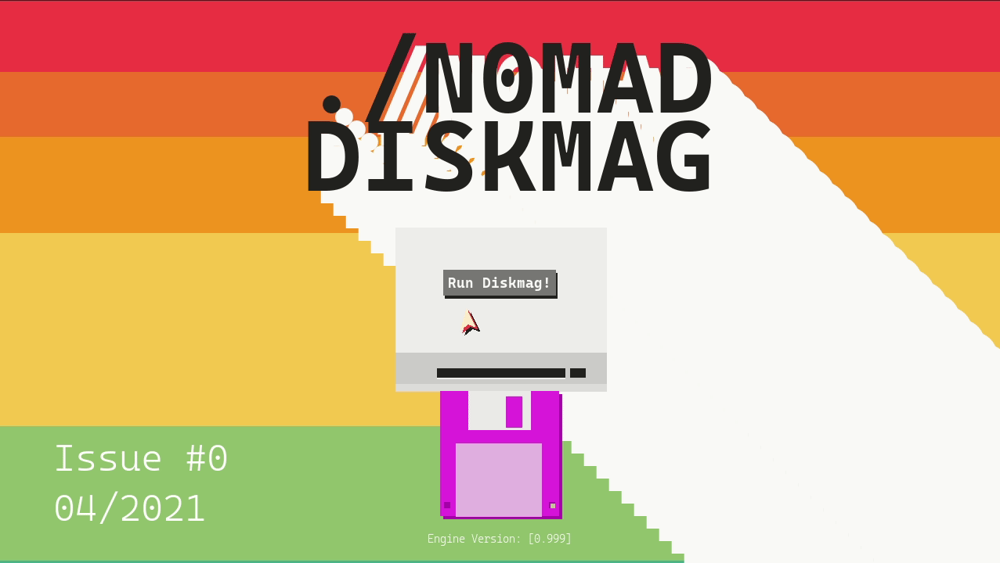
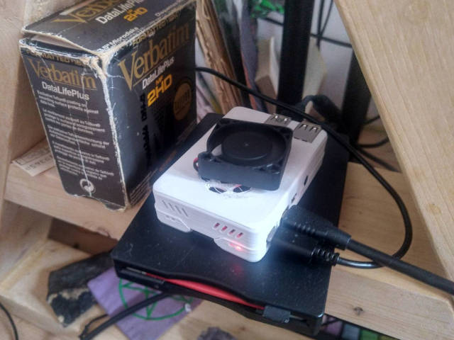

# Nomad Diskmag


E-zine on a 1.44 floppy tailored made on Raspberry Pi computer. 

## Issues

- Issue #0 04/2021 [IN PRODUCTION]


## Requiments

- python3
- pygame
- (optional) 1.44MB FDD and a floppy drive



## Running

- ```cd Mag```
- ```./run.sh```